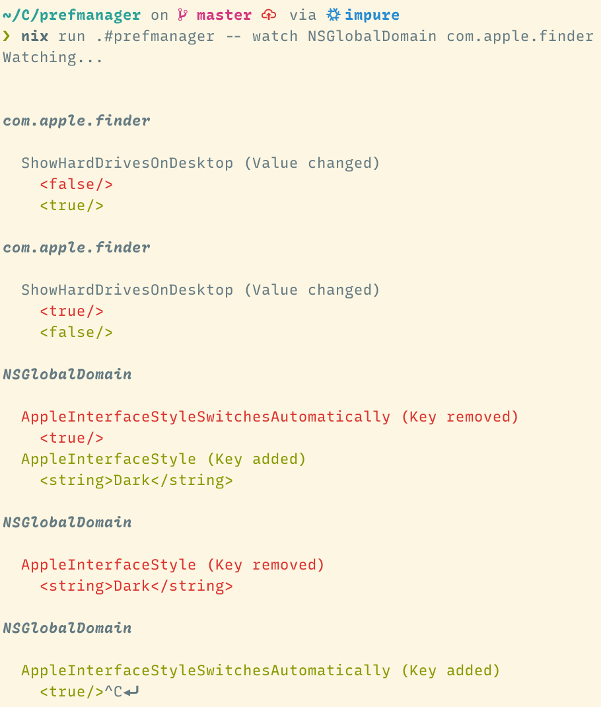

# macOS Preferences Manager

This project is a WIP.

## Usage

Currently available commands:

```
> prefmanager --help

macOS Preferences Manager - a utility for working with macOS preferences.

Usage: prefmanager COMMAND

Available options:
  -h,--help                Show this help text

Available commands:
  watch                    Watch domain(s) for changes.
  domains                  List all domains.
  keys                     List the current keys in a domain.
```

Watch functionality:

```
> prefmanager watch --help

Usage: prefmanager watch (DOMAIN... | (-a|--all))
  Watch domain(s) for changes

Available options:
  DOMAIN...                Domain(s) that will be watched
  -a,--all                 Watch all domains including NSGlobalDomain
  -h,--help                Show this help text
```


