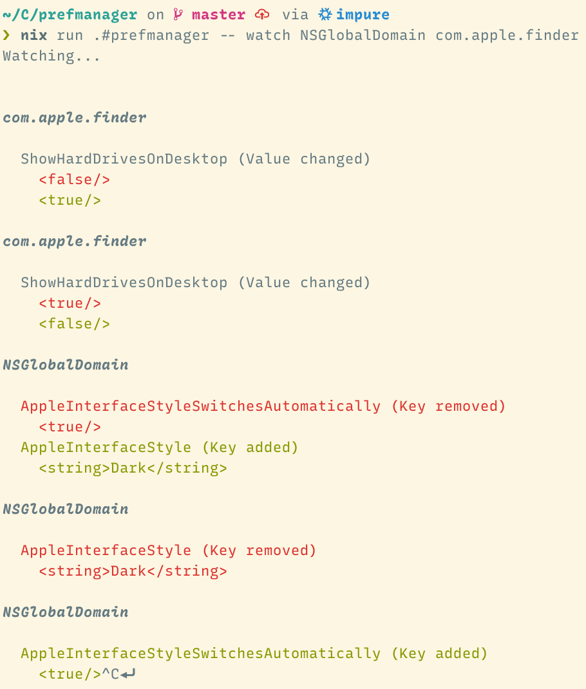

# macOS Preferences Manager

A CLI utility for working with macOS preferences. Lists domains, lists keys
in a domain, and watches domains for changes — useful for figuring out which
`defaults` key a System Settings toggle actually flips.

## Install

### With Nix (flakes)

```sh
# One-shot
nix run github:malob/prefmanager -- domains

# Persistent install
nix profile install github:malob/prefmanager
```

### Without Nix

Install [GHCup](https://www.haskell.org/ghcup/), then:

```sh
git clone https://github.com/malob/prefmanager
cd prefmanager
cabal install
```

The bundled `cabal.project.freeze` pins the exact dependency versions used in
CI, so you'll build with the same plan that's tested.

## Usage

```
> prefmanager --help
macOS Preferences Manager - a utility for working with macOS preferences.

Usage: prefmanager COMMAND

Available options:
  -h,--help                Show this help text

Available commands:
  watch                    Watch domain(s) for changes
  domains                  List all domains
  keys                     List the current keys in a domain
  ignore-defaults          Print the built-in ignore patterns and the default
                           config path
```

Watch:

```
> prefmanager watch --help
Usage: prefmanager watch [--plain] [--interval SECS] [--no-builtin-ignores]
                         [--ignore DOMAIN[:KEY]] [--ignore-file PATH]
                         (DOMAIN... | (-a|--all))

  Watch domain(s) for changes

Available options:
  --plain                  Non-interactive output (no ANSI cursor tricks;
                           timestamps each event). Use this when piping to a
                           file.
  --interval SECS          Polling interval in seconds (0 = no delay).
                           Fractional values allowed. (default: 1)
  --no-builtin-ignores     Disable the built-in ignore patterns
  --ignore DOMAIN[:KEY]    Ignore rule (repeatable). Both sides support * and ?
                           globs. DOMAIN alone ignores the whole domain;
                           DOMAIN:KEY ignores a specific key.
  --ignore-file PATH       Path to a file of ignore rules (one per line, # for
                           comments). Defaults to
                           ~/.config/prefmanager/ignore.conf if it exists.
  DOMAIN...                Domain(s) that will be watched
  -a,--all                 Watch all domains including NSGlobalDomain
  -h,--help                Show this help text
```



### Filtering noise

`watch` ships with a list of built-in ignore patterns covering macOS
background daemons that rewrite preference keys constantly without representing
real user-configurable state — DuetKit timestamps, CloudKit account caches,
Spotlight engagement counters, Finder/Dock recent-items lists, and so on.
Run `prefmanager ignore-defaults` to see the current list.

You can extend the filter from the CLI:

```sh
# Ignore one whole domain
prefmanager watch --ignore com.apple.spotlight --all

# Ignore a specific key (supports * and ? globs on both sides)
prefmanager watch --ignore 'com.apple.dock:recent-apps' --all
prefmanager watch --ignore '*:NSWindow Frame *' --all
```

…or from a config file (default location:
`~/.config/prefmanager/ignore.conf` if it exists, or pass `--ignore-file PATH`):

```
# Lines starting with '#' are comments; blank lines are ignored.

# Ignore a whole domain
com.apple.spotlight

# Ignore a specific key
com.apple.dock:recent-apps

# Glob across all domains
*:NSWindow Frame *
```

Disable the built-ins entirely with `--no-builtin-ignores` if you want to
inspect raw state.

### Plain (non-interactive) output

Pass `--plain` to drop the ANSI cursor manipulation and timestamp each
change event. This is what you want when piping the watcher to a log file
during a long session (e.g. setting up a new Mac):

```sh
prefmanager watch --plain --all > ~/setup-changes.log 2>&1 &
```

## Development

For day-to-day development:

```sh
nix develop          # drops you into a shell with GHC, cabal, HLS
cabal build
cabal run prefmanager -- domains
```

Maintenance procedures (bumping GHC, adding deps, refreshing the freeze file,
extending the GHC matrix) are documented in [CLAUDE.md](./CLAUDE.md).
